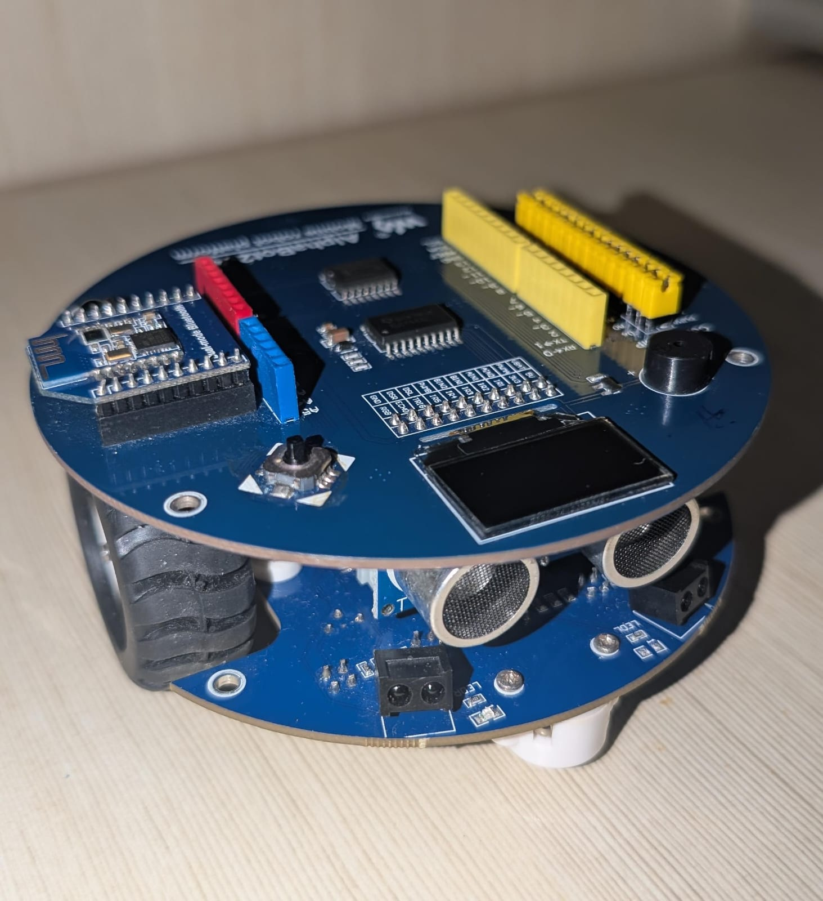

# Line-Following Robot for Waveshare AlphaBot2 AR

## Overview

This project implements an autonomous line-following robot on the Waveshare AlphaBot2 AR platform. The robot uses five infrared sensors to detect a black line on a white surface and employs a PID controller to maintain precise center alignment while navigating the track. The system includes motor control, real-time feedback via OLED display, RGB LED indicators, and comprehensive debugging output.

The Waveshare AlphaBot2 AR is a robotic development platform featuring dual DC motors, a five channel infrared line-tracking sensor array, a 128x64 OLED display, programmable RGB LEDs, and button inputs. It is fully compatible with Arduino for custom programming.

## Project Goals

1. Implement infrared sensor logic combined with PID control to complete an easy track consisting of continuous line segments accurately and without any deviation from the path center.
2. Extend the system to successfully navigate an advanced track that includes gaps between line segments while maintaining stable forward progress.

## Features

- Automatic multi point sensor calibration through controlled spinning motion
- Real-time line position calculation and PID-based steering correction
- OLED display for calibration instructions, progress visualization, and startup confirmation
- RGB LED status indicators with dynamic rainbow animation during operation
- Serial debugging output showing raw sensor values, error terms, PID contributions, and motor corrections
- Differential motor speed control for smooth turning
- Emergency stop logic to prevent runaway behavior when the line is lost
- Tunable parameters for base speed and PID gains to optimize performance on different tracks
- Support for both continuous and gapped line configurations

## Technologies Used

- Programming environment: Arduino IDE with C.
- Microcontroller platform: Arduino-compatible board integrated with AlphaBot2 AR
- Core libraries:
  - TRSensors for infrared line sensor reading, calibration, and position calculation
  - Adafruit_NeoPixel for RGB LED control
  - Adafruit_SSD1306 and Adafruit_GFX for OLED display management
  - Wire for I2C communication with the PCF8574 I/O expander (button and beeper interface)
- Hardware components: Waveshare AlphaBot2 AR chassis (motors, five infrared sensors, OLED, NeoPixels)

## Demonstration:

### Video 1: Easy Track (Continuous Line)

### Video 2: Advanced Track (With Gaps)

### Project Picture

Add the image and video files to the respective `images/` and `videos/` folders in the repository for proper rendering on GitHub.

## How It Works

### Sensor Calibration

After the first button press, the robot executes a 10-second calibration routine. It alternates motor directions to spin in place while repeatedly calling `trs.calibrate()`. This process records the minimum and maximum reflectance values for each of the five sensors, allowing the `readLine()` function to compute a normalized position value between 0 and 4000 (with 2000 representing the exact center of the sensor array). A second button press confirms calibration and starts operation.

### PID Control Loop

The core logic runs continuously in `loop()`:

- `position = trs.readLine(sensorValues)` obtains the current line position.
- `error = position - 2000.0f` calculates the deviation from center.
- The PID terms are computed as:
  - Proportional: `PID_KP * error`
  - Integral: `PID_KI * integral` (with windup clamping at ±5000)
  - Derivative: `PID_KD * (error - last_error)`
- The resulting correction is optionally scaled by base speed and clamped.
- Motor speeds are adjusted differentially:
  - Negative correction increases left motor PWM while keeping right at base speed.
  - Positive correction decreases right motor PWM while keeping left at base speed.

Tunable constants (`BASE_SPEED = 60`, `PID_KP = 0.18`, `PID_KI = 0.00012`, `PID_KD = 18.0`) were optimized through iterative testing.

### Goal Achievement

The first goal (easy continuous track) is met through the precise PID response. The proportional term provides immediate correction, the derivative damps oscillations, and the small integral term eliminates steady-state error, resulting in very little observable deviation at the chosen base speed.

The second goal (advanced track with gaps) is achieved by the inherent behavior of `trs.readLine()`. When the robot encounters a gap, the sensor array continues to report an interpolated position based on the most recent valid readings. The integral term maintains directional memory, and the derivative term ensures smooth re-acquisition upon re-entering the line. The emergency stop condition (`sensorValues[1..3] > 900`) activates only for prolonged off-track situations, preventing false triggers during short gaps.

Additional code elements include OLED status messages, serial debug printing of every PID component, and continuous RGB LED animation via the `Wheel()` color function.

## Setup and Installation

1. Assemble the Waveshare AlphaBot2 AR according to the official hardware guide and connect it to a computer via USB.
2. Install the required libraries through the Arduino IDE Library Manager:
   - Adafruit NeoPixel
   - Adafruit SSD1306
   - Adafruit GFX Library
   - TRSensors (install from Waveshare GitHub repository or provided example bundle)
3. Open the file `Line_Robot.ino` in the Arduino IDE.
4. Select the correct Arduino board type and COM port under Tools menu.
5. Click Upload to compile and flash the sketch to the board.

Once uploaded, power on the robot, place it on the track, and press the button to initiate calibration. After the spinning sequence completes and the OLED shows "Calibration Done !!!", press the button again to start line following. Adjust PID constants in the code header if further tuning is required for specific track conditions.
